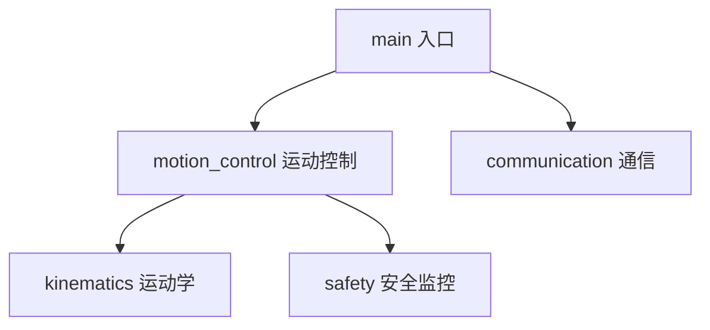

# C++ 代码简易说明书编写指南（AI 指导文件）

> **用途**：本文件用于指导 AI 为大型 C++ 代码库编写"简易说明书"。
> **适用场景**：代码包含多个类、多个文件夹（模块），每个模块/类功能独立，且单个类或文件内容较长。
> **目标读者**：后续接手代码、需要快速理解系统结构与上手方式的开发人员。

---

## 一、总体原则

编写说明书时必须遵守以下原则：

1. **分层描述、由粗到细**：先系统总览，再模块，最后关键类。严禁一上来就逐文件、逐函数翻译。
2. **抓接口不抓细节**：重点描述"对外提供什么、依赖什么、被谁调用"，`private` 实现细节原则上不写。
3. **写给接手的人看**：读者需要的是"去哪找、怎么上手"，而不是每行代码的解释。
4. **稳定优先**：优先写不易过时的内容（架构、模块职责、接口约定）；易变的实现细节少写或不写。
5. **图文结合**：架构图、流程图、时序图优先于大段文字，图文比例建议约 3:7。
6. **篇幅控制**：系统总览控制在 1~2 页，任何人 10 分钟内能读完总览部分。

---

## 二、编写前的准备工作

在动笔之前，AI 必须先完成以下代码勘察工作：

### 2.1 勘察步骤

1. **扫描目录结构**：列出所有文件夹和文件，识别模块划分（通常一个文件夹 = 一个模块）。
2. **寻找入口**：定位 `main()` 或库的对外导出接口，确定程序的启动流程。
3. **识别构建系统**：查看 `CMakeLists.txt` / `Makefile` / `.sln` / `.vcxproj` 等，确认依赖库、编译方式、产物类型（可执行程序 or 库）。
4. **梳理依赖关系**：通过 `#include` 关系和构建配置，推断模块间的调用方向。
5. **识别核心类**：被多处引用的类、承担主流程职责的类，列为"关键类"；仅在单一文件内部使用的辅助类不列入。

### 2.2 信息不足时的处理

- 若某模块职责无法从代码推断，标注"（职责待确认）"，**严禁凭空编造**。
- 若存在命名含糊的文件（如 `utils.cpp`、`common.h`），必须打开查看并写明其实际内容。

---

## 三、说明书的标准结构

说明书固定采用以下三层结构，章节顺序不得调整：

```
简易说明书
├── 第1层：系统总览
├── 第2层：模块（文件夹）说明
├── 第3层：关键类说明
└── 附录（术语表、编译运行说明）
```

---

### 3.1 第 1 层：系统总览

包含且仅包含以下四项内容：

#### （1）功能描述
用 1~3 句话说明整个系统做什么。禁止使用"本系统功能强大"之类的空话。

**示例**：
> 本系统是一个机械臂主手控制程序，负责采集医生操作意图、规划机械臂运动轨迹并下发控制指令。

#### （2）模块划分图
用 Mermaid 图或 ASCII 图画出所有模块及其调用/依赖关系。**每个文件夹对应一个方块**。

**示例（Mermaid）**：


#### （3）主流程说明
描述程序从启动到退出的关键步骤，用编号列表，每步一行。

**示例**：
> 1. 读取配置文件
> 2. 初始化通信链路
> 3. 进入主循环：采集指令 → 规划轨迹 → 下发控制
> 4. 收到退出信号后释放资源并退出

#### （4）编译与运行
简要说明依赖、编译命令、运行方式。若内容较多可移至附录。

---

### 3.2 第 2 层：模块（文件夹）说明

**每个文件夹写一小节**，统一使用以下固定模板，不得增删字段：

| 字段 | 说明要求 |
|------|---------|
| 模块名称 | 文件夹路径，如 `motion_control/` |
| 职责 | 一句话说明该模块负责什么 |
| 对外接口 | 其他模块调用它的入口（类名或函数名） |
| 依赖 | 依赖了哪些其他模块 / 第三方库 |
| 文件清单 | 每个文件一句话说明其作用 |

**示例**：

> #### 模块：`motion_control/`
> | 字段 | 内容 |
> |------|------|
> | 职责 | 管理机械臂运动轨迹的规划与执行 |
> | 对外接口 | `MotionController::planPath()`、`MotionController::execute()` |
> | 依赖 | `kinematics/`、第三方库 Eigen |
> | 文件清单 | `controller.h/.cpp` 控制器主类；`trajectory.cpp` 轨迹插值实现；`config.h` 参数定义 |

---

### 3.3 第 3 层：关键类说明

#### 筛选规则
- **只写核心类**：入口类、被 ≥2 个模块调用的类、承担主流程职责的类。
- 纯内部辅助类、数据结构包装类（仅存数据无逻辑）**不写**，可合并为一句"其余为辅助类，见源码"。

#### 固定模板

```
类名：MotionController
位置：motion_control/controller.h
职责：管理机械臂运动轨迹的规划与执行
关键成员（只列 public）：
  - init()          初始化控制器，读取配置
  - planPath()      根据目标位姿规划路径
  - execute()       执行当前路径
被谁调用：MainLoop、CommandParser
调用谁：Kinematics、MotorDriver
备注：内部状态机见源码中 execute() 的注释
```

每个类的说明**不超过半页**。

---

### 3.4 附录

1. **术语表**：代码中出现的领域术语（如关节、位姿、轨迹点）统一在此解释一次，正文不再重复解释。
2. **编译运行详细说明**（若总览中未展开）。

---

## 四、长文件与长类的处理技巧

当单个类或文件内容很长时，**严禁逐函数翻译**，必须采用以下压缩手段：

1. **按功能分区**：把成员函数按职责分组（初始化类 / 核心算法类 / 工具类），只详细说明核心算法部分。
2. **只写 public 接口**：private 实现细节最多一句"内部实现见源码注释"。
3. **用图代替文字**：类内部有复杂流程或状态切换时，画流程图 / 状态图，禁止用超过 10 行的文字描述流程。
4. **标注阅读入口**：明确告诉读者"想看 XXX 功能，直接看 `solve()` 方法，其他都是它的准备步骤"。
5. **合并同类项**：多个功能相似的类（如多种具体算法实现），用一张表格对比说明，不逐个展开。

---

## 五、写作风格要求

1. **语言**：中文为主，代码标识符（类名、函数名、文件名）保留原文并用反引号包裹。
2. **句式**：用陈述句，一句一意；禁止"可能、大概、应该"等不确定表述（不确定内容应标注"待确认"）。
3. **篇幅**：
   - 系统总览：1~2 页
   - 每个模块：0.5~1 页
   - 每个关键类：≤0.5 页
   - 整份说明书建议控制在 10~20 页以内。
4. **格式**：全文使用 Markdown；标题层级不超过四级；表格用于结构化信息，图用于关系与流程。

---

## 六、禁止事项（红线）

- ❌ 逐文件、逐函数地翻译代码。
- ❌ 把源码注释原样复制充当说明。
- ❌ 编造代码中不存在的功能或接口。
- ❌ 大段粘贴代码片段（单个代码块不超过 10 行，除非必要）。
- ❌ 调整第三章规定的章节顺序。
- ❌ 在关键类说明中展开 private 实现细节。

---

## 七、自检清单

完成说明书后，AI 必须逐项核对以下清单，全部通过才算合格：

- [ ] 系统总览是否包含功能描述、模块图、主流程、编译运行四项？
- [ ] 每个文件夹是否都有一节模块说明，且使用了固定模板？
- [ ] 关键类是否经过筛选（非全部类），且每个类使用固定模板？
- [ ] 是否存在逐函数翻译或大段代码粘贴？
- [ ] 所有不确定内容是否已标注"待确认"而非凭空断言？
- [ ] 总览部分是否能在 10 分钟内读完？
- [ ] 模块依赖关系图是否与代码实际 `#include` / 调用关系一致？

---

## 八、推荐的辅助工具（可选）

编写过程中可借助以下工具提高效率：

| 工具 | 用途 |
|------|------|
| Doxygen | 从头文件注释自动生成 API 文档，说明书可直接引用 |
| cpp-dependencies / CMake `--graphviz` | 自动生成模块依赖图 |
| IDE 调用层次功能 | 快速确认"谁调用谁" |

---

*本指南版本：v1.0。若代码库有特殊约定（如已有 Doxygen 注释规范），以项目实际约定为准，并在说明书开头注明。*
